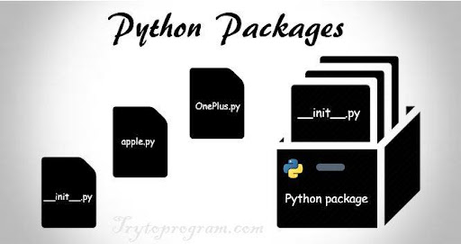
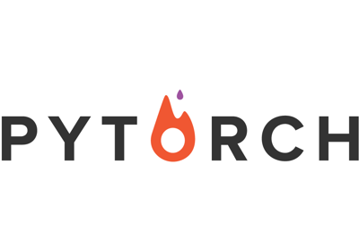

                                                   
# **Python Packages**    
We learned that modules are files containing Python statements and definitions, like function and class definitions. We will learn in this chapter how to bundle multiple modules together to form a package.

A package is basically a directory with Python files and a file with the name __init__.py. This means that every directory inside of the Python path, which contains a file named __init__.py, will be treated as a package by Python. It's possible to put several modules into a Package.

Packages are a way of structuring Python’s module namespace by using "dotted module names". A.B stands for a submodule named B in a package named A. Two different packages like P1 and P2 can both have modules with the same name, let's say A, for example. The submodule A of the package P1 and the submodule A of the package P2 can be totally different. A package is imported like a "normal" module. We will start this chapter with a simple example.

## **Creating a Package** 
We will demonstrate with a very simple example how to create a package with some Python modules. First of all, we need a directory. The name of this directory will be the name of the package, which we want to create. We will call our package "simple_package". This directory needs to contain a file with the name __init__.py. This file can be empty, or it can contain valid Python code. This code will be executed when a package is imported, so it can be used to initialize a package, e.g. to make sure that some other modules are imported or some values set. Now we can put all of the Python files which will be the submodules of our module into this directory. We create two simple files a.py and b.py just for the sake of filling the package with modules.

The content of a.py:

def bar():
    print("Hello, function 'bar' from module 'a' calling")

The content of b.py:

def foo():
    print("Hello, function 'foo' from module 'b' calling")

We will also add an empty file with the name __init__.py inside of simple_package directory.

Package can be loaded or imported by using the following syntaxes:-
1) from simple_package import a, b
2) import simple_package
   simple_package.a.bar()
   simple_package.b.foo()

## **Some important packages in Python** 
1) ### Scrapy
   
   Scrapy is a free and open-source web-crawling framework written in Python. Originally designed for web scraping, it can also be used to extract data using APIs or as a general-purpose web crawler.It is currently maintained by Zyte formerly Scrapinghub, a web-scraping development and services company.

   Scrapy project architecture is built around "spiders", which are self-contained crawlers that are given a set of instructions. Following the spirit of other don't repeat yourself frameworks, such as Django,it makes it easier to build and scale large crawling projects by allowing developers to reuse their code. Scrapy also provides a web-crawling shell, which can be used by developers to test their assumptions on a site’s behavior.

2) ### PyTorch
   
   PyTorch is a library for Python programs that facilitates building deep learning projects. We like Python because is easy to read and understand. PyTorch emphasizes flexibility and allows deep learning models to be expressed in idiomatic Python.
   In a simple sentence, think about Numpy, but with strong GPU acceleration. Better yet, PyTorch supports dynamic computation graphs that allow you to change how the network behaves on the fly, unlike static graphs that are used in frameworks such as Tensorflow.
   
3) ### Scikit-Learn
   
    Scikit-learn is a Python module integrating a wide range of state-of-the-art machine learning algorithms for medium-scale supervised and unsupervised problems. This package focuses on bringing machine learning to non-specialists using a general-purpose high-level language. Emphasis is put on ease of use, performance, documentation, and API consistency. It has minimal dependencies and is distributed under the simplified BSD license, encouraging its use in both academic and commercial settings.

4) #### MoviePy
    
    MoviePy is to videos what Pillow is to images. It provides a range of functionality for common tasks associated with importing, modifying, and exporting video files. It also lets you do things like insert titles into videos or rotate videos 90 degrees (if for some reason you decide you want to do that).

    Like Pillow, MoviePy is not intended as a tool for advanced data manipulation. If you’re writing a video editing app, you’ll probably also need to rely on OpenCV (which can work with videos as well as images) to provide the advanced functionality that MoviePy lacks. But for most standard tasks involving videos in Python code, MoviePy gets the job done quite well.

 